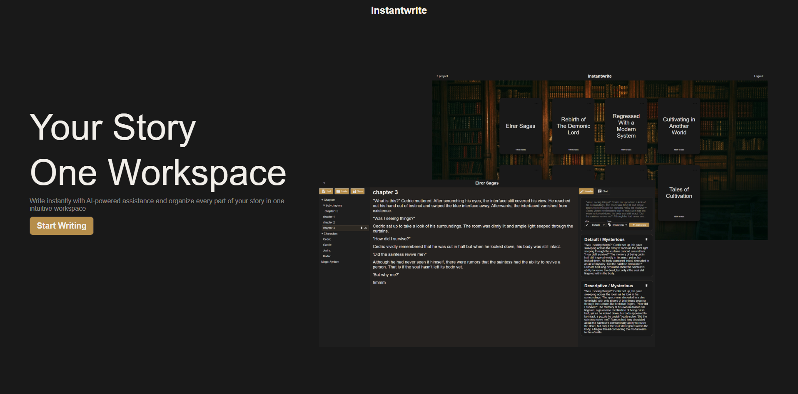

# Instantwrite 


<p align="center">
  <strong>An application for authors to write, organize, and refine their stories in one place.</strong>
</p>

## Table of contents
* [About](#About)
* [Features](#Features)
* [Tech Stack](#Tech-Stack)
* [Project Structure](#Project-Structure)
* [Getting Started](#Getting-Started)
* [Documentation](#Documentation)
* [What's Next](#Whats-Next)
* [Limitations](#Limitations)
* [Known Issues](#Known-Issues)
* [Author](#Author)
* [License](#License)

## About
**Instantwrite** is a writing app for aspiring authors, combining LLM-powered writing tools with a file-tree system to keep
entire projects organized. Built with [Tiptap](https://tiptap.dev/) for text editing, [DND kit](https://dndkit.com/) 
for a responsive drag and drop functionality for file-tree, and [Groq](https://groq.com/) to power LLM tools.

This is my first personal project with the goal of not just creating a full-stack application, but writing maintainable source code,
REST API design, backend architecture, as well as learning React for responsive user interfaces.

---

## Features

### Core Features

| Feature                       | Description                                                                               |
| ----------------------------- | ----------------------------------------------------------------------------------------- |
| **Rich Text Editor**          | A text editor to start writing your stories.                                              |
| **AI chat**                   | A chatbot to prompt for writing or story related assistance.                              |
| **Text editor aware AI chat** | Selected text from editor can be seen by LLM chat for context aware prompts.              |
| **Rewrite selected text**     | Selected text from editor can be rewritten by AI using preferred style and tone.          |
| **File-tree**                 | A file-tree panel to organize your chapters, characters, worldbuilding, etc in one place. |


### User Experience

| Feature | Description                                                                                                      |
| ------------------------ | ----------------------------------------------------------------------------------------------- |
| **Last Active Document** | Previously active document is automatically displayed on editor for better UX.                  |
| **Project list**         | The home page displays all your projects in one place for ease of access.                       |
| **Editor title**         | Project's title is displayed on header to let user know which project they are working on.      |

### Security

| Feature                      | Description                                                                              |
| ---------------------------- | ---------------------------------------------------------------------------------------- |
| **Hashed Passwords**         | Passwords are hashed with [bcrypt](https://www.npmjs.com/package/bcrypt) before being stored.|
| **Sessions**                 | Authentication uses server-side sessions stored in database.|
| **Project scoped by userID**| Project queries are protected by an authenticated user ID to prevent cross-user access. |
| **Rate-limits**| Server endpoints are rate-limited to prevent abuse. |
| **Joi validated auth**| Authentication inputs are validated using [Joi](https://joi.dev/). |

---

## Tech Stack

### Front-end
| Layer | Technology | Purpose |
| --- | --- | --- |
| **UI Library** | [React](https://react.dev/) | Component-based user interface. |
| **Page Routing** | [React Router](https://reactrouter.com/) | Client-side page routing. |
| **Text Editor** | [Tiptap](https://tiptap.dev/)  | Rich text editor. Also provide context to LLM. |
| **Drag and Drop** | [DND-kit](https://dndkit.com/) | File tree drag-and-drop interactions. |

### Back-end
| Layer | Technology | Purpose |
| --- | --- | --- |
| **Backend Framework** | [Express.js](https://expressjs.com/) | REST resource endpoints and RPC LLM action endpoints |
| **Runtime** | [Node.js](https://nodejs.org/) | JavaScript runtime for the backend |
| **Database** | [PostgreSQL](https://www.postgresql.org/) | Persistent storage for users, projects, documents, and sessions |
| **Database Driver** | [node-postgres](https://node-postgres.com/) | PostgreSQL client for Node.js |
| **Authentication** | [express-session](https://github.com/expressjs/session) + [connect-pg-simple](https://github.com/voxpelli/node-connect-pg-simple) | Server-side sessions stored in PostgreSQL |
| **Password Hashing** | [bcrypt](https://github.com/kelektiv/node.bcrypt.js) | Secure password hashing |
| **Validation** | [Joi](https://joi.dev/) | Runtime validation for authentication inputs |
| **Rate Limiting** | [express-rate-limit](https://express-rate-limit.mintlify.app/) | Request throttling for sensitive endpoints |
| **AI Provider** | [Groq](https://groq.com/) | LLM-powered chat, summarization, and rewrite features |
| **AI SDK** | [Groq SDK](https://github.com/groq/groq-typescript) | Node.js client for calling Groq models |

### Others
| Layer | Technology | Purpose |
| --- | --- | --- |
| **Build Tool** | [Vite](https://vite.dev/) | Frontend development server and build tooling |
| **Environment Config** | [dotenv](https://github.com/motdotla/dotenv) | Local environment variable loading |

---

## Project Structure
```
InstantWrite/
├── docs/                         # Frontend/Backend documentation
│
├── client/                       # React + Vite frontend
│   │
│   ├── index.html                # main HTML
│   ├── package.json              # Client dependencies
│   ├── vite.config.mjs           # VITE config
│   └── src/
│       ├── App.jsx               # Route definitions
│       ├── main.jsx              # App entry point
│       ├── assets/               # Shared assets
│       ├── components/           # Shared UI components
│       ├── pages/                # Route-level page components
│       ├── util/                 # Shared utils
│       └── features/
│           ├── auth/             # Signup/login components
│           ├── error-404/        # 404 page components
│           ├── landing/          # Landing page components
│           ├── home/             # Home page components
│           ├── projects-list/    # Display user project list
│           ├── work-space/       # Layout panels and coordinate states/actions
│           ├── file-tree/        # File-tree panel
│           ├── editor/           # Editor panel
│           └── assistant/        # AI assistant panel
│
├── server/                       # Node.js + Express API server
│   │
│   ├── package.json              # Server dependencies
│   ├── server.js                 # Express entry point
│   └── src/
│       ├── config/               # Database and session config
│       ├── const/                # Backend constants
│       ├── controller/           # Request/response handlers
│       ├── helpers/              # Service helper functions
│       ├── middleware/           # Error handling, rate limiting, session validation
│       ├── models/               # Database schema and seed files
│       ├── routes/               # API route definitions
│       └── services/             # Business logic, database queries, external API calls
```

---

## Getting Started

### Pre-requisites
* [postgres](https://www.postgresql.org/download/)
* pg admin (comes with postgres)
* [Groq API key](https://console.groq.com/keys)
* npm

### 1. Clone & Install

```
git clone https://github.com/ScriptedClone/Instantwrite
cd Instantwrite
cd client
npm install
cd ..
cd server
npm install
```

### 2. Configure Environment Variables
Create a .env file under /server

```
GROQ_API_KEY=your_groq_api_key 
DATABASE_URL=your_database_url
NODE_SESSION_SECRET=your_session_secret
```

### 3. Populate database
* Open pgadmin, open query workspace and paste database table setup on [schema.sql](./server/src/models/schema.sql). 
* Paste the seed data from [seed.sql](./server/src/models/seed.sql).

### 4. Run server
```
cd server 
nodemon
```

### 5. Run client
```
cd ..
cd client
npm run dev
```
open http://localhost:5173

---

## Documentation
- [API Reference](./docs/api-reference.md)
- [Assistant Panel Chat](./docs/client/assistant-panel-chat.md)
- [File Tree](./docs/client/file-tree.md)
- [Database Design](./docs/server/database.md)
- [Example Project Map](./docs/example-project-map.md)

---

## What's next?

### Editor and Writing Workflow
- Add PDF and DOCX import support.
- Add document word count.
- Add keyboard shortcuts for undo and saving project changes.
- Improve the project save workflow.

### AI Features
- Support BYOK (bring-your-own-key) API configuration for LLM features.
- Improve existing LLM-powered writing tools and add new ones.
- Add features that support story planning and outlining.
- Format Chat Completion responses.

### Security and Data
- Encrypt user project data in database.

### Landing Page
- Add more landing page sections, including features, FAQ, and footer.
- Improve mobile responsiveness.

### UI/UX
- Improve UI/UX throughout the application.

### Platform Support
- Desktop version using Electron.

---

## Limitations
- No automated test suites.
- Additional input validation across API request payloads.
- Application uses one Groq API key for all LLM features.
- Users must manually save projects for changes to persist.
- LLM rewrite and chat history not persisted on refresh.

## Known Issues
- Some database error messages leak to client. Discovered during SQL syntax error.
- Chat responses are not format-constrained and can return long unstructured markdown blocks.
- Loading and error states UI handling.

---

## Acknowledgements
- [React](https://react.dev/) and [Vite](https://vite.dev/) for the frontend application.
- [Express](https://expressjs.com/) and [Node.js](https://nodejs.org/) for backend API.
- [PostgreSQL](https://www.postgresql.org/) for database storage.
- [React Router](https://reactrouter.com/) for client-side routing.
- [Tiptap](https://tiptap.dev/) for rich text editor.
- [Groq](https://groq.com/) for LLM-powered writing assistance.
- [Flaticon](https://www.flaticon.com/), [Icons8](https://icons8.com/), [Google Fonts Icons](https://fonts.google.com/icons) for button icons.
- [Unsplash](https://unsplash.com/) for home page background.

---

## Author
**Tracee Anrei Miasco (ScriptedClone)** 

## License
This project is licensed under the MIT License - see the [LICENSE](LICENSE) file for details.
