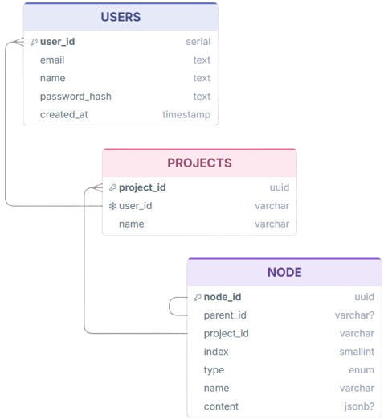

# Related Tables - Projects


## Users

Stores account credentials used for authentication.

| Column   | Type | Nullable | Notes                     |
|----------|------|----------|----------------------------|
| email    | text | no       | used for login, unique     |
| password | text | no       | stored hashed              |

---

## Projects

A project is owned by a single user, containing a tree of nodes.

**Relationship:** `projects.user_id` → `users.id` (many-to-one)

| Column  | Type | Nullable | Notes            |
|---------|------|----------|-------------------|
| user_id | uuid | no       | FK → users.id, determines project ownership |

---

## Nodes

Normalized representation of `folderChildrenMap` and `nodeMap`, used to
persist file-tree structure to the database. Columns define a node's
position relative to its siblings on the front-end file tree.

**Relationship:** `nodes.project_id` → `projects.id` (many-to-one)

**Self-relationship:** `nodes.parent_id` → `nodes.id` (parent must be a
`folder`-type node; null for root-level nodes)

| Column     | Type  | Nullable | Notes                                |
|------------|-------|----------|----------------------------------------|
| project_id | uuid  | no       | FK → projects.id, groups nodes by project |
| parent_id  | uuid  | yes      | FK → nodes.id, must reference a folder-type node |
| index      | int   | no       | sibling order — not a database index  |
| type       | text  | no       | `document` or `folder`, see [Node Type](#node-type) |
| name       | text  | no       | folder/document display name          |
| content    | jsonb | yes      | Tiptap JSON, only present for type=document, see [Tiptap JSON](#tiptap-json) |

---

## Node Type

### Document
This node contains a Tiptap JSON object in `content`.

### Folder
This node acts as a `parent_id` target for other nodes. Has no `content`.

---

## Tiptap JSON

JSON representation of a Tiptap document, stored in `nodes.content`.

**example:**
```json
{
  "type": "doc",
  "content": [
    {
      "type": "paragraph",
      "content": [
        {
          "type": "text",
          "text": "This is an example."
        }
      ]
    }
  ]
}
```